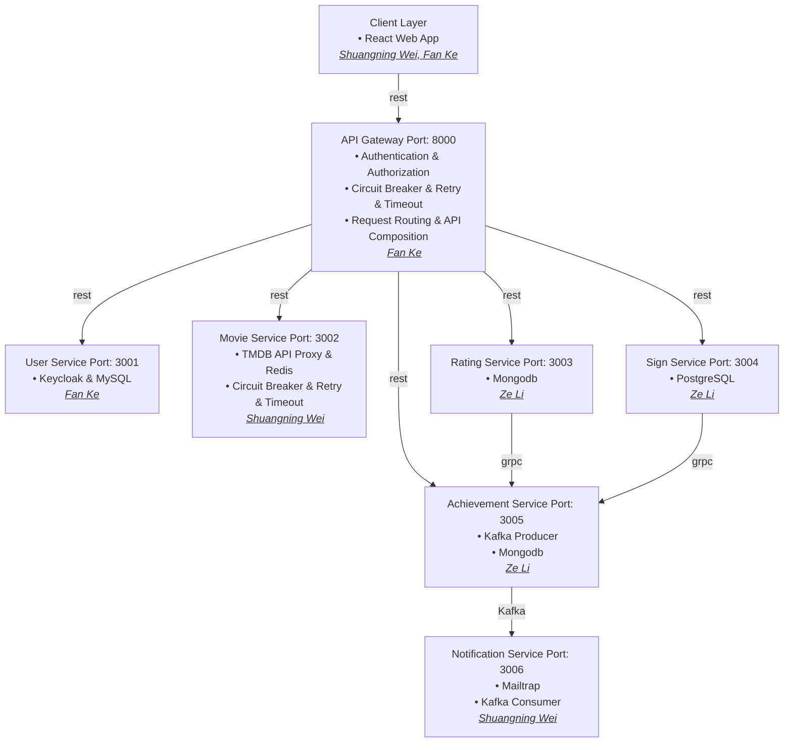

## Architecture Overview


---
## (Optional) For developer local test and setup using docker compose
#### To start all services in docker compose
```bash
docker compose -p cinequest up -d
```
#### To stop all services in docker compose
```bash
docker compose -p cinequest down
```

#### To build all services images and push to docker hub rapidly
**Build Images**
```bash
$ export DOCKER_ACCOUNT=YOUR_DOCKER_ACCOUNT && export DOCKER_PASSWORD=YOUR_DOCKER_PASSWORD && mvn spring-boot:build-image -DskipTests
```


# CineQuest API Gateway

This document outlines the available API endpoints for the CineQuest application, accessible through the API Gateway. All requests from the frontend should be directed to the gateway.

## Base URL

All API endpoints are prefixed with the gateway's base URL. Assuming the gateway is running on `http://localhost:8000`, the base URL is `http://localhost:8000`.

## Authentication

Authentication is handled via Keycloak. The gateway proxies requests to the Keycloak service for login, registration, and token refresh.

- **Keycloak Endpoints (Proxied):**
    - All endpoints under `/keycloak/**` are proxied to the Keycloak service.

## Services

### Movie Service

Provides access to movie data, including popular movies, movie details, and search functionality. These endpoints are publicly accessible.

- **GET `/api/movies/popular`**
    - Description: Retrieves a list of popular movies.
    - Query Parameters:
        - `page` (integer, optional, default: 1): The page number for pagination.
    - Example: `GET /api/movies/popular?page=2`

- **GET `/api/movies/{id}`**
    - Description: Retrieves details for a specific movie.
    - Path Parameters:
        - `id` (long): The ID of the movie.
    - Example: `GET /api/movies/12345`

- **GET `/api/movies/search`**
    - Description: Searches for movies based on a query.
    - Query Parameters:
        - `q` (string, required): The search query.
        - `page` (integer, optional, default: 1): The page number for pagination.
    - Example: `GET /api/movies/search?q=Inception&page=1`

- **GET `/api/movies/health`**
    - Description: Health check endpoint for the movie service.
    - Example: `GET /api/movies/health`

### Rating Service

Allows users to create, update, delete, and retrieve movie ratings. These endpoints require authentication and user information is injected via headers.

- **POST `/api/ratings`**
    - Description: Creates a new rating for a movie.
    - Headers:
        - `X-User-Id` (string, required): The ID of the authenticated user.
        - `X-User-Email` (string, required): The email of the authenticated user.
        - `X-User-Name` (string, required): The name of the authenticated user.
    - Request Body:
        ```json
        {
          "movieId": 12345,
          "rating": 4.5,
          "comment": "Great movie!"
        }
        ```
    - Example: `POST /api/ratings` with appropriate headers and body.

- **PUT `/api/ratings`**
    - Description: Updates an existing rating for a movie.
    - Headers:
        - `X-User-Id` (string, required): The ID of the authenticated user.
    - Request Body:
        ```json
        {
          "movieId": 12345,
          "rating": 5.0,
          "comment": "Even better on rewatch!"
        }
        ```
    - Example: `PUT /api/ratings` with appropriate headers and body.

- **DELETE `/api/ratings`**
    - Description: Deletes a user's rating for a specific movie.
    - Query Parameters:
        - `movieId` (integer, required): The ID of the movie whose rating is to be deleted.
    - Headers:
        - `X-User-Id` (string, required): The ID of the authenticated user.
    - Example: `DELETE /api/ratings?movieId=12345` with appropriate headers.

- **GET `/api/ratings`**
    - Description: Retrieves a user's rating for a specific movie.
    - Query Parameters:
        - `userId` (string, required): The ID of the user.
        - `movieId` (integer, required): The ID of the movie.
    - Example: `GET /api/ratings?userId=user123&movieId=12345`

- **GET `/api/ratings/all`**
    - Description: Retrieves all ratings made by a specific user.
    - Query Parameters:
        - `userId` (string, required): The ID of the user.
        - `page` (integer, optional, default: 0): The page number for pagination.
        - `size` (integer, optional, default: 20): The number of items per page.
    - Example: `GET /api/ratings/all?userId=user123&page=1&size=10`

- **GET `/api/ratings/movie/{movieId}`**
    - Description: Retrieves all ratings for a specific movie.
    - Path Parameters:
        - `movieId` (integer, required): The ID of the movie.
    - Query Parameters:
        - `page` (integer, optional, default: 0): The page number for pagination.
        - `size` (integer, optional, default: 20): The number of items per page.
    - Example: `GET /api/ratings/movie/12345?page=0&size=10`

- **GET `/api/ratings/movie/{movieId}/stats`**
    - Description: Retrieves rating statistics for a specific movie.
    - Path Parameters:
        - `movieId` (integer, required): The ID of the movie.
    - Example: `GET /api/ratings/movie/12345/stats`

### Sign Service

Handles user sign-in events. Requires authentication and user information is injected via headers.

- **POST `/api/sign`**
    - Description: Records a user's sign-in event.
    - Headers:
        - `X-User-Id` (string, required): The ID of the authenticated user.
        - `X-User-Email` (string, required): The email of the authenticated user.
        - `X-User-Name` (string, required): The name of the authenticated user.
    - Example: `POST /api/sign` with appropriate headers.

### Achievement Service

Provides access to user badges. Requires authentication.

- **GET `/api/achievements/users/{userId}/badges`**
    - Description: Retrieves all badges earned by a specific user.
    - Path Parameters:
        - `userId` (string, required): The ID of the user.
    - Example: `GET /api/achievements/users/user123/badges`

## Fallback Endpoints

These endpoints are used by the gateway to provide a graceful degradation of service when a downstream service is unavailable. They are not intended for direct frontend access but are listed for completeness.

- **GET, POST, PUT, DELETE, PATCH `/fallback/global`**
- **GET, POST, PUT, DELETE, PATCH `/fallback/movie`**
- **GET, POST, PUT, DELETE, PATCH `/fallback/rating`**
- **GET, POST, PUT, DELETE, PATCH `/fallback/sign`**
- **GET, POST, PUT, DELETE, PATCH `/fallback/achievement`**
- **GET, POST, PUT, DELETE, PATCH `/fallback/notification`**
- **GET, POST, PUT, DELETE, PATCH `/fallback/user`**
