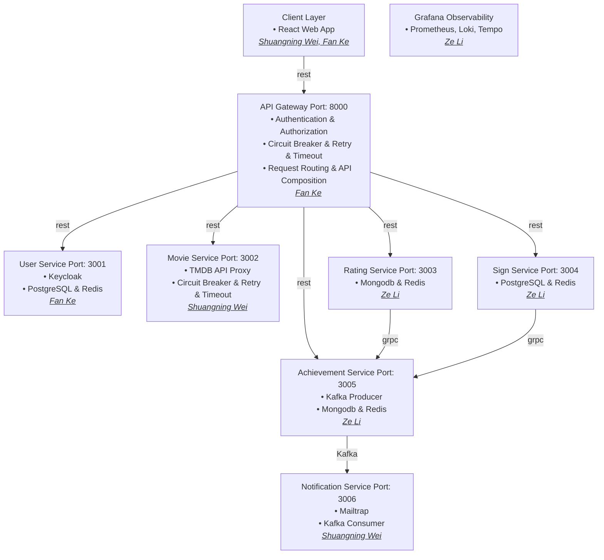

## Architecture Overview

```mermaid
flowchart TD
    %% Client Layer
    A[Client Layer
    • React Web App
    <i><u>Shuangning Wei, Fan Ke</u></i>]
    
    %% API Gateway
    B[API Gateway Port: 8000</br>• Authentication & Authorization
    • Circuit Breaker & Retry & Timeout
    • Request Routing & API Composition
    <i><u>Fan Ke</u></i>]
    
    %% Microservices
    C[User Service Port: 3001
    • Keycloak
    • PostgreSQL & Redis
    <i><u>Fan Ke</u></i>]
    
    D[Movie Service Port: 3002
    • TMDB API Proxy
    • Circuit Breaker & Retry & Timeout
    <i><u>Shuangning Wei</u></i>]
    
    E[Rating Service Port: 3003
    • Mongodb & Redis
    <i><u>Ze Li</u></i>]
    
    F[Sign Service Port: 3004
    • PostgreSQL & Redis
    <i><u>Ze Li</u></i>]
    
    G[Achievement Service Port: 3005
    • Kafka Producer
    • Mongodb & Redis
    <i><u>Ze Li</u></i>]
    
    H[Notification Service Port: 3006
    • Mailtrap
    • Kafka Consumer
    <i><u>Shuangning Wei</u></i>]
    
    I[Grafana Observability
    • Prometheus, Loki, Tempo
    <i><u>Ze Li</u></i>]
    
    %% Connections
    A -->|rest| B
    B -->|rest| C
    B -->|rest| D
    B -->|rest| E
    B -->|rest| F
    B -->|rest| G
    

    E -->|grpc| G
    F -->|grpc| G
    
    G -->|Kafka| H

%%    B -.-> I
%%    C -.-> I
%%    D -.-> I
%%    E -.-> I
%%    F -.-> I
%%    G -.-> I
%%    H -.-> I
```
